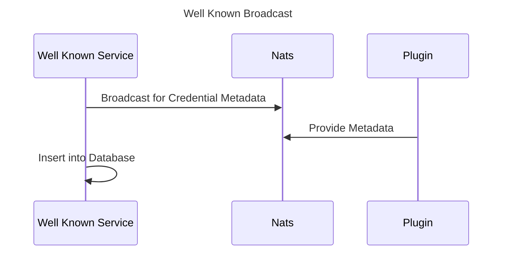

# Introduction

The well known service implements the well known issuer metadata part of the [OID4VCI](https://openid.net/specs/openid-4-verifiable-credential-issuance-1_0.html#name-credential-issuer-metadata) protocol. This definition is a mix of static data for the issuer itself and some metadata of potentially "dynamic" credential metadata, which is split by this implementation. The reason for that is, that credential metadata e.g. credential types, versions, formats, protocols etc. might be changed from time to time in cause of crypto agility, customer needs or new versions. The service itself is therefore implemented in a way, which allows it to broadcast for plugins which are implementing a special credential type. Each plugin responds then with their metadata, and the service provides it to the public. 

Other services can use the service internally to cross check if a special credential type exists (e.g. the issuer service)

# Flows



# Bootstrap

## Configuration

|KEY|                             DEFAULT|             REQUIRED| REFERENCE|
|---|------------------------------------|---------------------|----------|
|LOG_LEVEL    |                   info                   | t||
|IS_DEV        |                   false                  | t||
|LISTEN_ADDR  |                   127.0.0.1              | t||
|LISTEN_PORT  |                   8080                    |t||
|POSTGRES_HOST    |              127.0.0.1              | t||
|POSTGRES_PORT   |                5432                   | t||
|POSTGRES_DATABASE  |             postgres               | t||
|POSTGRES_USER     |              postgres               | t||
|POSTGRES_PASSWORD |              postgres               | t||
|POSTGRES_PARAMS  |               sslmode:require        | f |https://www.postgresql.org/docs/current/libpq-ssl.html |
|NATS_URL         |               127.0.0.1              | t||
|NATS_QUEUE_GROUP   |                 -                  | f||
|NATS_REQUEST_TIMEOUT  |              -                  | f||
|GIT_IMAGE_PATH  |                  |  -||
|GIT_REPO        |                   | -||
|GIT_TOKEN      |                    | - ||
|GIT_INTERVAL   |                    | -||
|GATEWAY_LOCATION_HEADER_KEY|||
|OPEN_ID_ISSUER|
|CREDENTIAL_ISSUER_IMPORTER  |    BROADCAST||

# Developer Information

## Broadcast Importer

The broadcast importer listens on NATS events (via Subscribe) and stores registered issuers
in the PostgreSQL database.

## Git Importer

The git importer can checkout a repository with the folder structure documented below
and read issuer data from json files.

### Folder Structure

The folders must contain the following structure: 

```
-tenantID
  - images
  - credentials
  - issuer.json
``` 

The folder images can contain images like png. Credentials must contain json.

### Issuer.json

Must consist of a json file with the following structure (templates will be replaced e.g. {{origin by https://xyz}}): 

```
   "CredentialIssuer": "{{.Origin}}"
   "CredentialEndpont": "{{.Origin}}/credentials"
   "AuthorizationServers": []
   ...
   "CredentialsSupported":"{{.Credentials}}"
```