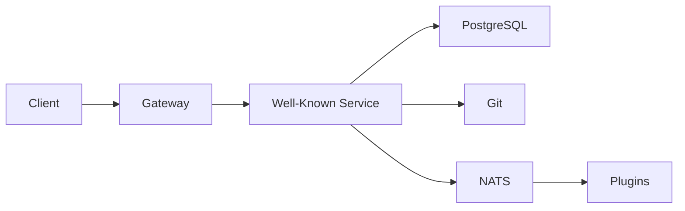
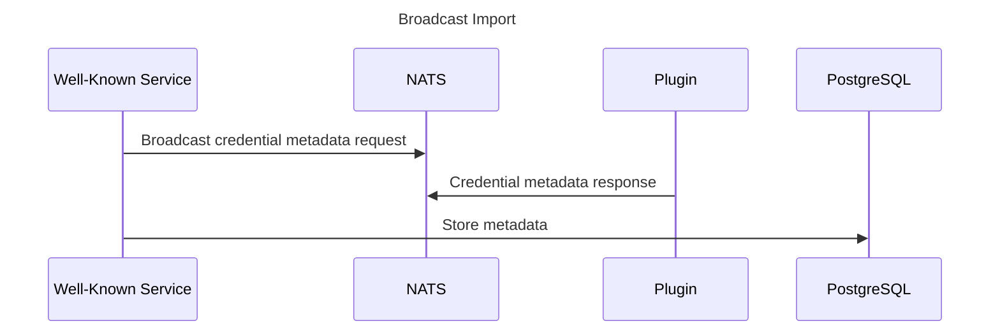
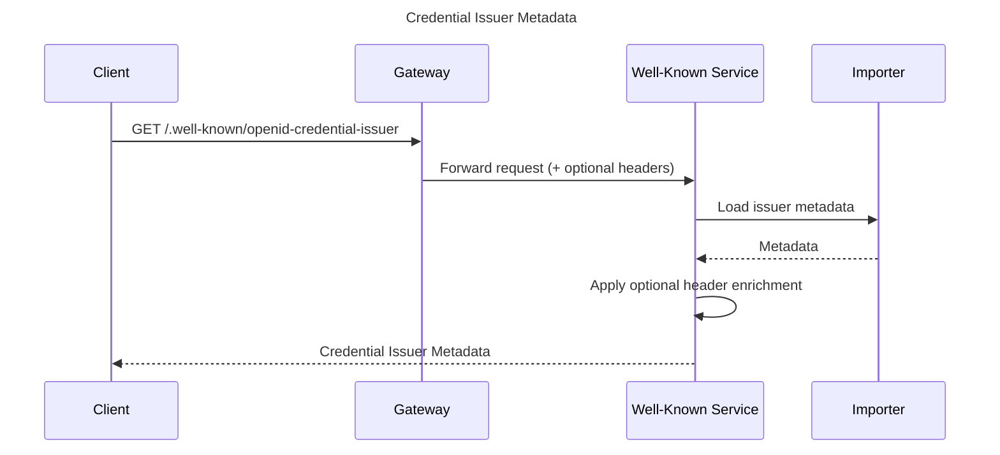

# Introduction

The Well-Known Service implements the metadata endpoints defined by the OpenID for Verifiable Credential Issuance (OID4VCI) specification. It serves tenant-specific Credential Issuer, Authorization Server and Verifier metadata and supports multiple metadata sources.

The service separates **static issuer metadata** from **dynamic credential metadata**. While issuer metadata is typically managed centrally, credential metadata (credential types, formats, cryptographic suites, protocol versions, etc.) may change over time due to cryptographic agility, new product capabilities or customer-specific requirements.

To support this, the service provides a pluggable importer architecture. Metadata can be obtained from different backends such as:

- Broadcast plugins via NATS
- Git repositories
- Additional importers

The resulting metadata is exposed through the standard Well-Known endpoints.

When deployed behind an API Gateway (e.g. Envoy or Traefik), selected metadata fields can optionally be enriched from HTTP request headers, allowing a single deployment to serve multiple tenants with different public endpoints.

Other services (for example issuer services) can also consume the Well-Known Service internally to validate supported credential types or resolve issuer metadata.

# Architecture


```mermaid
flowchart LR

Client --> Gateway
Gateway --> WKS["Well-Known Service"]

WKS --> PostgreSQL
WKS --> Git
WKS --> NATS

NATS --> Plugins
```

# Broadcast Flow


```mermaid
sequenceDiagram
title Broadcast Import

Well-Known Service->>NATS: Broadcast credential metadata request
Plugin->>NATS: Credential metadata response
Well-Known Service->>PostgreSQL: Store metadata
```

# Request Flow


```mermaid
sequenceDiagram
title Credential Issuer Metadata

Client->>Gateway: GET /.well-known/openid-credential-issuer
Gateway->>Well-Known Service: Forward request (+ optional headers)
Well-Known Service->>Importer: Load issuer metadata
Importer-->>Well-Known Service: Metadata
Well-Known Service->>Well-Known Service: Apply optional header enrichment
Well-Known Service-->>Client: Credential Issuer Metadata
```

# Configuration

## General

| Key | Default | Required |
|------|---------|----------|
| `LOG_LEVEL` | `info` | yes |
| `IS_DEV` | `false` | yes |
| `LISTEN_ADDR` | `127.0.0.1` | yes |
| `LISTEN_PORT` | `8080` | yes |

## PostgreSQL

| Key | Default | Required |
|------|---------|----------|
| `POSTGRES_HOST` | `127.0.0.1` | yes |
| `POSTGRES_PORT` | `5432` | yes |
| `POSTGRES_DATABASE` | `postgres` | yes |
| `POSTGRES_USER` | `postgres` | yes |
| `POSTGRES_PASSWORD` | `postgres` | yes |
| `POSTGRES_PARAMS` | `sslmode=require` | no |

## NATS

| Key | Default | Required |
|------|---------|----------|
| `NATS_URL` | `127.0.0.1` | yes |
| `NATS_QUEUE_GROUP` | - | no |
| `NATS_REQUEST_TIMEOUT` | - | no |

## Git Importer

| Key | Required |
|------|----------|
| `GIT_REPO` | no |
| `GIT_IMAGE_PATH` | no |
| `GIT_TOKEN` | no |
| `GIT_INTERVAL` | no |

## Importer

| Key | Default |
|------|---------|
| `CREDENTIAL_ISSUER_IMPORTER` | `BROADCAST` |

Supported importers:

- `BROADCAST`
- `GIT`

## Gateway Header Mapping

The Well-Known Service can optionally override or extend selected Credential Issuer Metadata fields using HTTP request headers. This is primarily intended for deployments behind API gateways that provide tenant-specific routing.

| Environment Variable | Description |
|----------------------|-------------|
| `WELLKNOWN_SERVICE_GATEWAY_CREDENTIAL_ISSUER_HEADER_KEY` | Overrides `credential_issuer`. |
| `WELLKNOWN_SERVICE_GATEWAY_AUTHORIZATION_SERVER_HEADER_KEY` | Appends an authorization server if not already present. |
| `WELLKNOWN_SERVICE_GATEWAY_CREDENTIAL_ENDPOINT_HEADER_KEY` | Overrides `credential_endpoint`. |
| `WELLKNOWN_SERVICE_GATEWAY_BATCH_CREDENTIAL_ENDPOINT_HEADER_KEY` | Overrides `batch_credential_endpoint`. |
| `WELLKNOWN_SERVICE_GATEWAY_DEFERRED_CREDENTIAL_ENDPOINT_HEADER_KEY` | Overrides `deferred_credential_endpoint`. |
| `WELLKNOWN_SERVICE_GATEWAY_NOTIFICATION_ENDPOINT_HEADER_KEY` | Overrides `notification_endpoint`. |

If a configured header is not present, the stored metadata remains unchanged.

# Helm Configuration

```yaml
gateway:
  credentialIssuerHeaderKey: ""
  authorizationServerHeaderKey: ""
  credentialEndpointHeaderKey: ""
  batchCredentialEndpointHeaderKey: ""
  deferredCredentialEndpointHeaderKey: ""
  notificationEndpointHeaderKey: ""
```

Example:

```yaml
gateway:
  credentialIssuerHeaderKey: X-Credential-Issuer
  authorizationServerHeaderKey: X-Authorization-Server
  credentialEndpointHeaderKey: X-Credential-Endpoint
  batchCredentialEndpointHeaderKey: X-Batch-Credential-Endpoint
  deferredCredentialEndpointHeaderKey: X-Deferred-Credential-Endpoint
  notificationEndpointHeaderKey: X-Notification-Endpoint
```

# Metadata Enrichment

The following Credential Issuer Metadata fields can be modified dynamically:

| Metadata Field | Behaviour |
|----------------|-----------|
| `credential_issuer` | Replaced from request header |
| `authorization_servers` | Header value appended uniquely |
| `credential_endpoint` | Replaced from request header |
| `batch_credential_endpoint` | Replaced from request header |
| `deferred_credential_endpoint` | Replaced from request header |
| `notification_endpoint` | Replaced from request header |

Header enrichment affects only the HTTP response. Persisted metadata is never modified.

# Developer Information

## Broadcast Importer

The Broadcast Importer periodically requests credential metadata from registered plugins using NATS. Responses are validated and stored in PostgreSQL.

## Git Importer

The Git Importer periodically checks out a repository and reads issuer metadata from JSON files.

### Repository Layout

```
tenant-id/
├── issuer.json
├── images/
└── credentials/
    ├── credential-a.json
    └── credential-b.json
```

The `images` directory may contain logos or additional assets referenced by issuer metadata.

The `credentials` directory contains credential metadata definitions.

### issuer.json

Template variables are supported and replaced during import.

Example:

```json
{
  "credential_issuer": "{{ .Origin }}",
  "credential_endpoint": "{{ .Origin }}/credential",
  "authorization_servers": [],
  "credential_configurations_supported": {{ .Credentials }}
}
```

# Typical Deployment

A common production deployment places the Well-Known Service behind a central API Gateway.

The gateway

- routes tenant-specific requests,
- injects tenant-specific endpoint URLs as HTTP headers,
- forwards the request to a shared Well-Known Service instance.

This allows the service to remain completely tenant-agnostic while exposing tenant-specific public metadata.